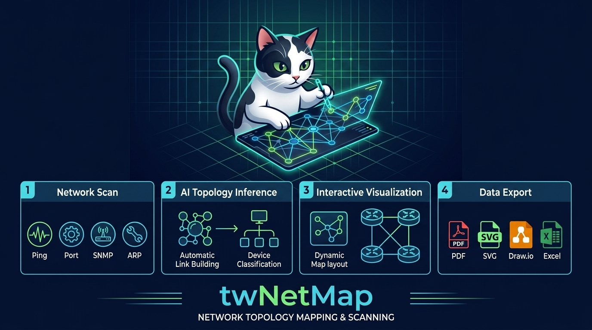
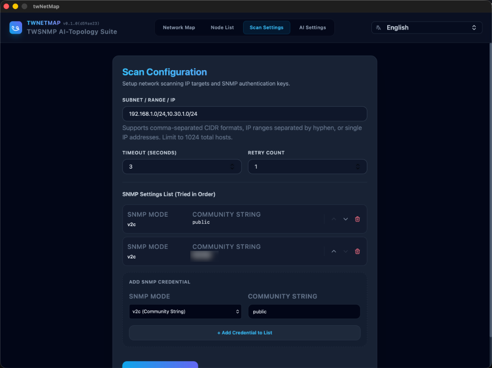
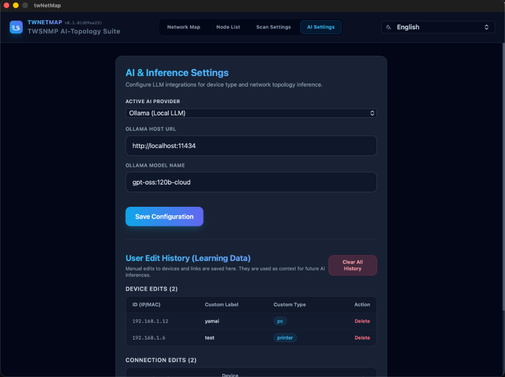
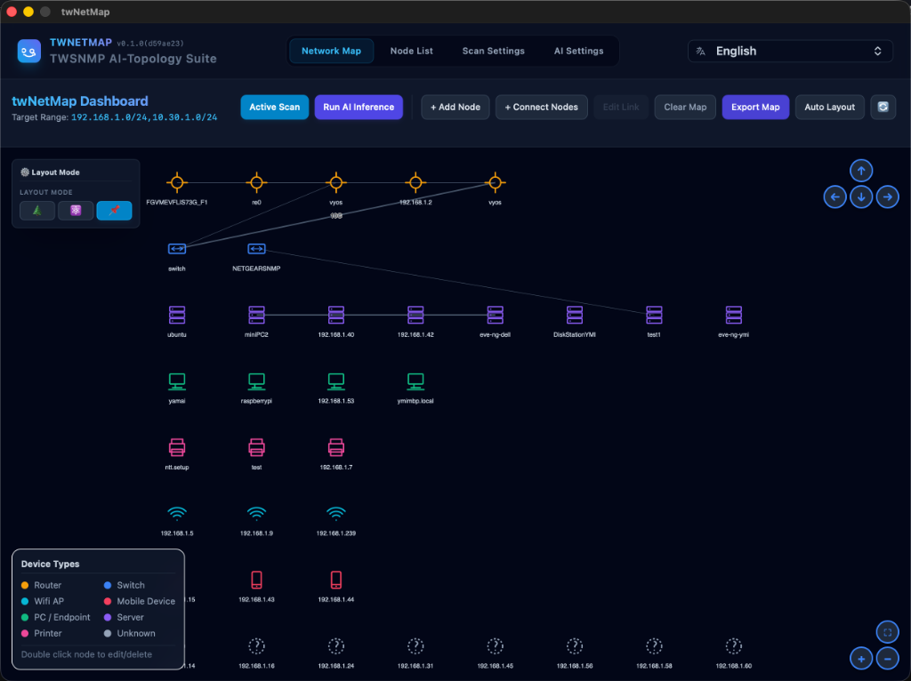
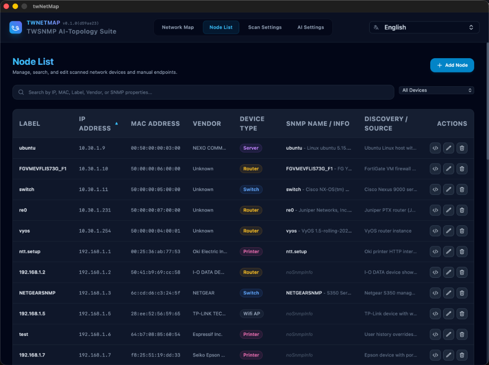
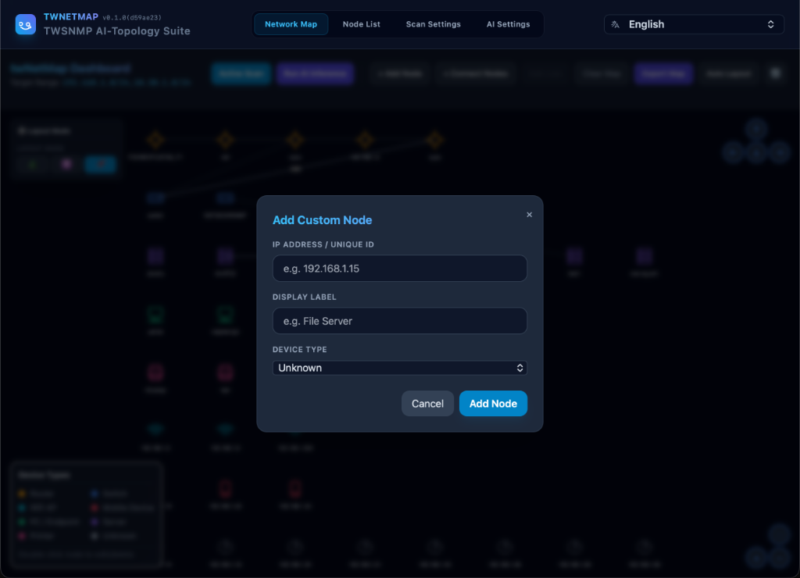
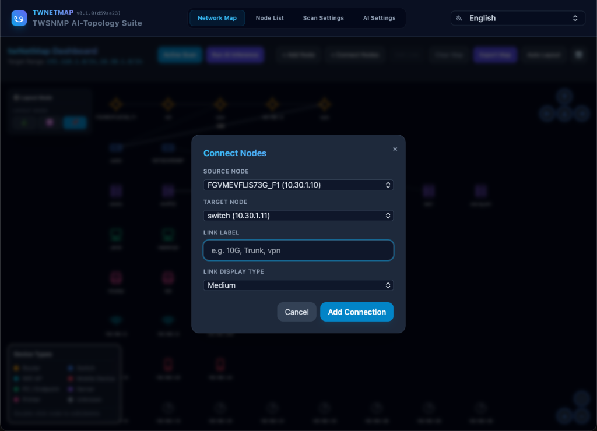
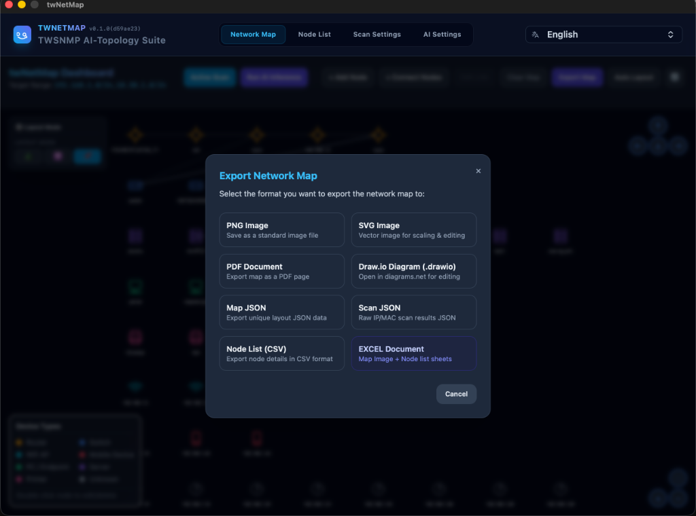
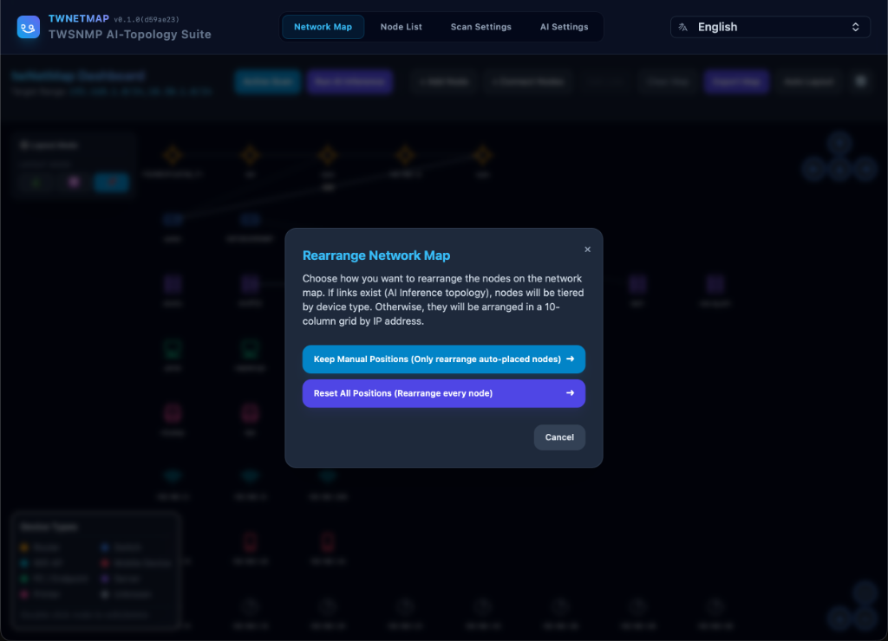

# twNetMap

[日本語 (Japanese)](README_ja.md)



An AI-powered network discovery tool that automatically generates network maps from scanned data. Built with Go, Wails v2, and Svelte.

---

## Key Features

1. **Active & Passive Network Scanning**
   - **Ping Check**: Verifies host reachability using ICMP (unprivileged UDP ping with a fallback to OS native commands).
   - **ARP Table Parsing**: Automatically extracts IP-MAC mapping tables from the local system and active SNMP agents.
   - **Port Scanning**: Scans common TCP ports (21, 22, 23, 25, 80, 110, 143, 161, 443, 3306, 3389, 5432, 8080, 9100). The scanning behavior is configurable via **Port Scan Mode**:
     - **OFF** (default): No active port scan. Attempts banner/connection checks only on key ports (21, 22, 23, 25, 80, 110, 143, 443, 8080) to confirm which are actually open. Suitable for firewall-protected environments.
     - **Safe**: Limits concurrency to 2 simultaneous connections per host with a 100 ms delay between scans (low-and-slow).
     - **Fast**: Scans all ports in parallel with higher concurrency (original behavior).
   - **SNMP Query (v2c/v3)**: Queries remote agents to retrieve system info (`sysName`, `sysDesc`), physical MAC addresses, and Link Layer Discovery Protocol (LLDP) neighbor details. For SNMP-enabled devices, open TCP ports are obtained from the `tcpConnTable` MIB (`.1.3.6.1.2.1.6.13.1.1`) instead of performing a port scan.
   - **Service Banner Grabbing**: Connects to open ports to capture SSH/FTP banners and parses/cleans HTML response titles.

2. **AI-Driven Topology Inference**
   - Integrates with multiple LLM providers: **Ollama**, **OpenAI**, and **Google Gemini** using [langchaingo](https://github.com/tmc/langchaingo).
   - Classifies device types into standard categories: `router`, `switch`, `wifi`, `mobile`, `pc`, `server`, `printer`, or `unknown`.
   - Utilizes structural reasoning (e.g., LLDP topology information) to automatically construct link relationships between devices.
   - **Feedback Loop**: Incorporates the user's manual modifications (node details or deleted links) back into the prompt history to adapt future inferences to user preferences.

3. **Interactive Network Map Visualization**
   - Renders maps dynamically using `vis-network`.
   - Allows users to add, edit, and delete nodes and links manually.
   - Drag-and-drop nodes to customize layouts or trigger automatic node rearrangement.

4. **Comprehensive Data Export**
   - **Graphics/Documents**: PNG, SVG, PDF
   - **Diagrams**: Draw.io (`.drawio`)
   - **Data**: JSON Map Data, JSON Raw Scan Results, CSV Node List, Excel Document (`.xlsx`)

---

## Installation

### Download from GitHub Releases
You can download the pre-built standalone binaries from the [GitHub Releases](https://github.com/twsnmp/twNetMap/releases) page.

#### macOS
- The macOS version is provided as a signed and notarized **PKG** installer (`.pkg`).
- Download the PKG file, double-click to open it, and follow the installation wizard.

#### Windows
- The Windows version is not digitally signed. When you extract and try to run the downloaded ZIP file, Windows Defender SmartScreen may block its execution.
- **How to unblock and run**:
  1. Extract the downloaded ZIP file.
  2. Right-click on `twNetMap.exe` in the extracted folder and select **Properties**.
  3. In the **General** tab, under the Security section at the bottom, check the **"Unblock"** box and click **OK**.
  4. Alternatively, if the blue "Windows protected your PC" warning screen appears when starting the app, click **"More info"** and then click the **"Run anyway"** button.

#### Linux
- The Linux version is provided as a **tar.gz** archive containing a standalone executable.
- Simply download and extract the tar.gz file — no special permission configuration is required.
- Depending on your network environment, outgoing SNMP requests (UDP port 161) and port scan traffic (various TCP ports) may be blocked by your local firewall (e.g. UFW or firewalld). If so, please review your firewall settings.

---

## Usage

Follow these steps to map your network:

### 1. Scan Settings
Set the target IP address range (CIDR like `192.168.1.0/24`, range like `192.168.1.1-192.168.1.50`, or comma-separated targets). Configure SNMP authentication parameters (Community string, SNMP v3 username/password) if you want to retrieve device information from SNMP agents. You can also choose the **Port Scan Mode** (OFF / Safe / Fast) to control how aggressively TCP ports are probed — useful for environments where firewalls may block or flag port scans.



### 2. AI Settings
Select your LLM provider (Google Gemini, OpenAI, or local Ollama) and input the API keys and model parameters. This LLM will be used to analyze neighbor relationships and classify device types.



### 3. Network Discovery and Topology Generation
Start the network scan. Once completed, the scanned device data will be analyzed by the AI, which automatically infers switch and router connections to construct the network map.



### 4. Map Adjustment and Export
You can drag and drop nodes to change the map layout, or add/delete nodes and links manually. The modifications you make are remembered by the system to train the AI to fit your network preferences. You can also view the tabular list of devices or export the map as PNG, SVG, PDF, CSV, Excel, or Draw.io files.



### 5. Adding Custom Nodes
If there are devices that were not automatically discovered, or if you want to add manual endpoints to the map, click the "+ Add Node" button on the dashboard. Enter the IP address or a unique ID, a display label, and select the device type.



### 6. Adding, Editing, and Deleting Node Connections
To create a link between two devices manually, click the "+ Add Link" button on the dashboard. Select the source node (From) and destination node (To) from the dropdown lists, optionally enter a label for the link (e.g. "10G, Trunk, vpn"), select the link line style, and click "+ Add Link".

Alternatively, you can display the link addition dialog by **holding the Shift key and clicking two devices on the map in sequence**.



#### Editing and Deleting Links
- **Edit**: Clicking and selecting a link on the map will enable the "Edit Link" button on the dashboard.
- **Delete**: Open the link edit dialog and click the "Delete" button inside the dialog.


### 7. Exporting Network Map & Data
To save your network map or raw discovery data, click the "Export" button on the dashboard. You can choose from the following formats:
- **PNG / SVG Image**: Save the visual map as standard or scalable vector graphics.
- **PDF Document**: Export the map as a PDF page.
- **Draw.io Diagram (.drawio)**: Open and edit the generated topology directly in Draw.io.
- **Map JSON**: Export the layout and node/link structured data.
- **Scan JSON**: Save the raw scanned IP/MAC and SNMP service details.
- **Node List (CSV)**: Export the device metadata table in CSV format.
- **Excel Document**: Export a structured spreadsheet containing both the map image and node sheet.



### 8. Auto-Rearranging the Network Map
To organize the layout of your network map automatically, click the "Auto Layout" button on the dashboard. You can choose one of the following options:
- **Keep Manual Positions (Only rearrange auto-mapped nodes)**: Reorganizes newly added or automatically discovered nodes while maintaining the locations of any nodes you have manually dragged and positioned.
- **Reset All Positions (Rearrange all nodes)**: Discards all manual positions and resets the layout of the entire network map. Nodes will be arranged in hierarchical layers by device type if connections exist, or in a 10-column grid sorted by IP address if no topology connection is defined.



### 9. Layout Mode Panel
The **"⚙️ Layout Mode" panel** is always visible in the **top-left corner of the map screen**, allowing you to switch the automatic layout algorithm in real time.

| Icon | Mode | Description |
|:---:|---|---|
| 🌲 | **Hierarchical** | Automatically arranges nodes in a layered hierarchy based on device type. Routers, switches, and PCs are organized from top to bottom, making it easier to understand the overall network structure. |
| ⚛️ | **Force-Directed** | Simulates attraction and repulsion forces between nodes, placing them at natural positions based on connection relationships. Well-suited for visually organizing complex topologies. |
| 📌 | **Static** | Disables automatic layout and locks nodes in the positions you have manually dragged them to. Use this when you want to preserve a custom arrangement. |

When **Hierarchical** or **Force-Directed** mode is selected, a **Spacing** slider appears at the bottom of the panel. Drag it to adjust the distance between nodes (50px–300px).

Your chosen layout mode and spacing setting are saved in the browser's `localStorage`, so they are automatically restored the next time you open the app.

### 10. Map Navigation Buttons
The **top-right** and **bottom-right** corners of the map screen display the built-in navigation controls provided by `vis-network`.

#### Top-Right: Pan (Scroll) Buttons

| Button | Function |
|:---:|---|
| ↑ | Scroll the map upward |
| ← | Scroll the map to the left |
| ↓ | Scroll the map downward |
| → | Scroll the map to the right |

#### Bottom-Right: Zoom Buttons

| Button | Function |
|:---:|---|
| 🔍 (center circle) | Fit all nodes into the visible screen area |
| **+** | Zoom in |
| **−** | Zoom out |

> **Keyboard Shortcuts**: You can also use the **arrow keys** (↑←↓→) to pan the map and the **`+` / `-` keys** to zoom in and out.

---

## Data Storage Location

By default, the application stores its configuration and data inside the `twNetMap` folder within the user's standard configuration directory.

### Default Storage Paths
*   **macOS**: `~/Library/Application Support/twNetMap`
*   **Windows**: `%APPDATA%\twNetMap` (e.g. `C:\Users\<Username>\AppData\Roaming\twNetMap`)
*   **Linux**: `~/.config/twNetMap`

### Generated Files
*   **`twnetmap.db`**: A bbolt (BoltDB) database file containing system configurations, scan results, network topology, and user action history.
*   **`secret.key`**: An encryption key file used to protect sensitive data (such as API keys and SNMP credentials) using AES-256-GCM.

### Customizing the Data Directory
You can override the default data storage directory by starting the application with the `-datadir` startup parameter:
```bash
./twNetMap -datadir /path/to/custom/dir
```

---

## Caution & Security Considerations

> [!WARNING]
> **Authorized Scanning Only**: This tool performs active network scanning (ICMP ping sweeps, TCP port scans, SNMP queries, and service banner grabbing). Scanning networks or hosts without proper authorization may violate security policies, terms of service, or local laws. Always ensure you have explicit permission to scan the target network before running this tool.

---

## Technical Stack

- **Backend (Go)**
  - Application Framework: [Wails v2](https://wails.io) (v2.12.0)
  - Database: [bbolt](https://github.com/etcd-io/bbolt) (embedded key-value store)
  - LLM Orchestration: [langchaingo](https://github.com/tmc/langchaingo)
  - SNMP Clients: [gosnmp](https://github.com/gosnmp/gosnmp)
  - Exporters: [gopdf](https://github.com/signintech/gopdf), [excelize](https://github.com/xuri/excelize)
- **Frontend (Svelte & CSS)**
  - UI Library: Svelte 5
  - Build System: Vite
  - Styles: Tailwind CSS 3
  - Visualization: `vis-network`

---

## Project Structure

- [main.go](main.go): The desktop entry point that boots the Wails application.
- [app.go](app.go): Wails binding methods exposing core database operations, scanning control, AI logic, and file dialogs.
- `backend/`:
  - [ai/ai.go](backend/ai/ai.go): Formulates system/user LLM prompts and handles provider authentication (Gemini, OpenAI, Ollama).
  - [scanner/scanner.go](backend/scanner/scanner.go): Handles IP range parsing, ICMP/Ping, TCP port sweeps, SNMP walking, and banner grabbing.
  - [datastore/db.go](backend/datastore/db.go): Manages local `bbolt` buckets storing scan results, node configurations, and user action history.
  - [datastore/crypto.go](backend/datastore/crypto.go): AES-256-GCM encryption utilities for protecting sensitive config fields (API keys, SNMP passwords).
- `frontend/`:
  - `src/App.svelte`: Root view coordinating layout and page routing.
  - `src/routes/`:
    - `NetworkMap.svelte`: The visual interface displaying nodes/links and handling user map actions.
    - `NodeList.svelte`: Direct list/table editor for discovered devices.
    - `ScanDataModal.svelte`: Modal dialog for viewing raw JSON scan result data.
    - `ScanSettings.svelte` / `AISettings.svelte`: Admin dashboards for scan targets and AI provider settings.

---

## How to Build

By using `mise`, you can automatically manage the required toolchains (Go and Node.js) and run the build/development tasks easily.

### Prerequisites
- [mise](https://mise.jdx.dev/) installed on your system.
- Wails CLI (Can be installed via `go install github.com/wailsapp/wails/v2/cmd/wails@latest` after installing Go via mise).

### Setup Tools
Install the required versions of Go and Node.js defined in `.mise.toml`:
```bash
mise install
```

### Run in Development Mode
To launch the application in debug mode with hot reloading:
```bash
mise run dev
```

### Build Production Binary
To compile the standalone production binary for your operating system (this automatically builds the frontend assets and compiles the Go backend with version flags):
```bash
mise run build
```
