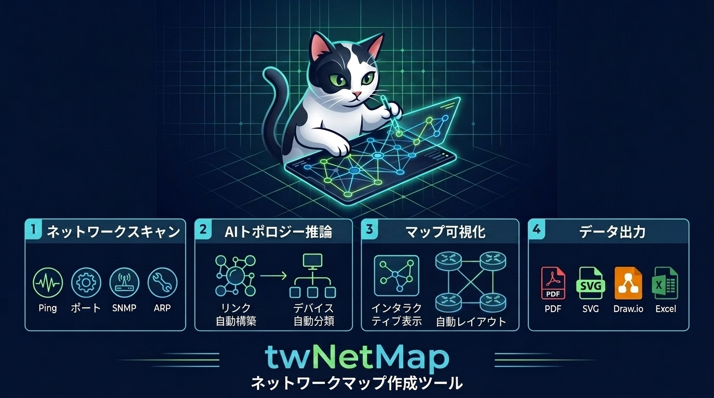
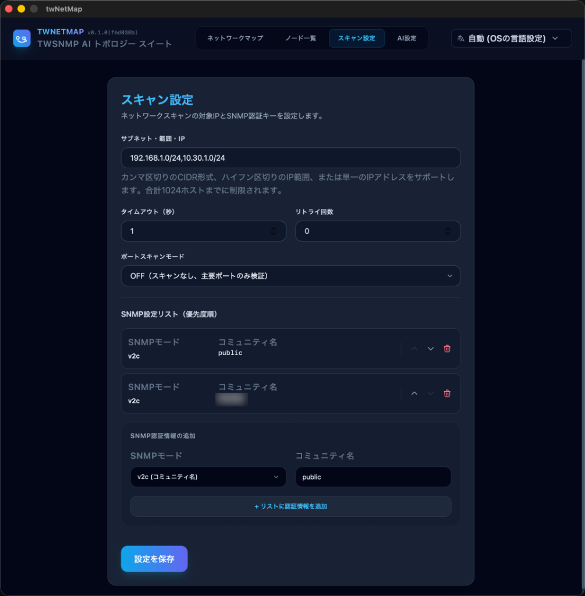
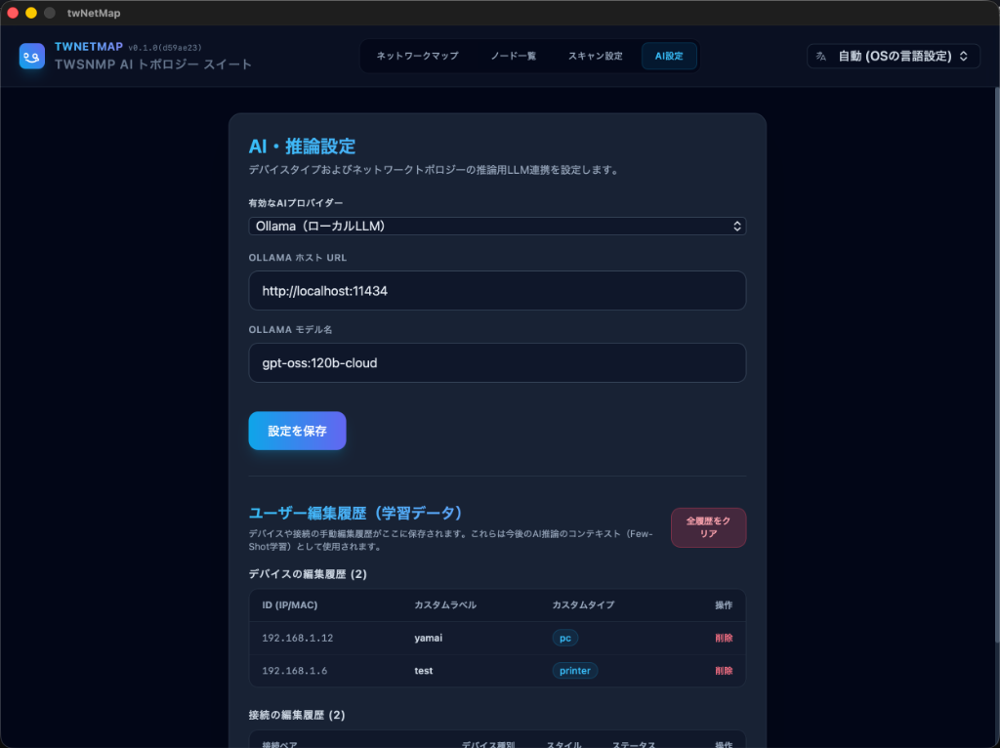
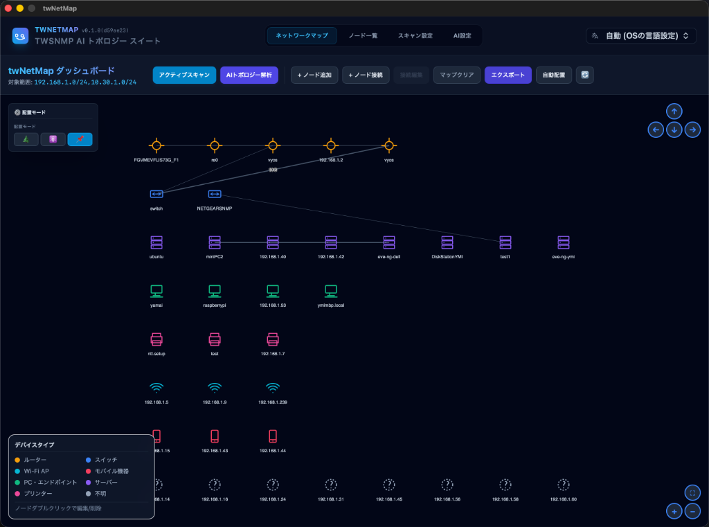
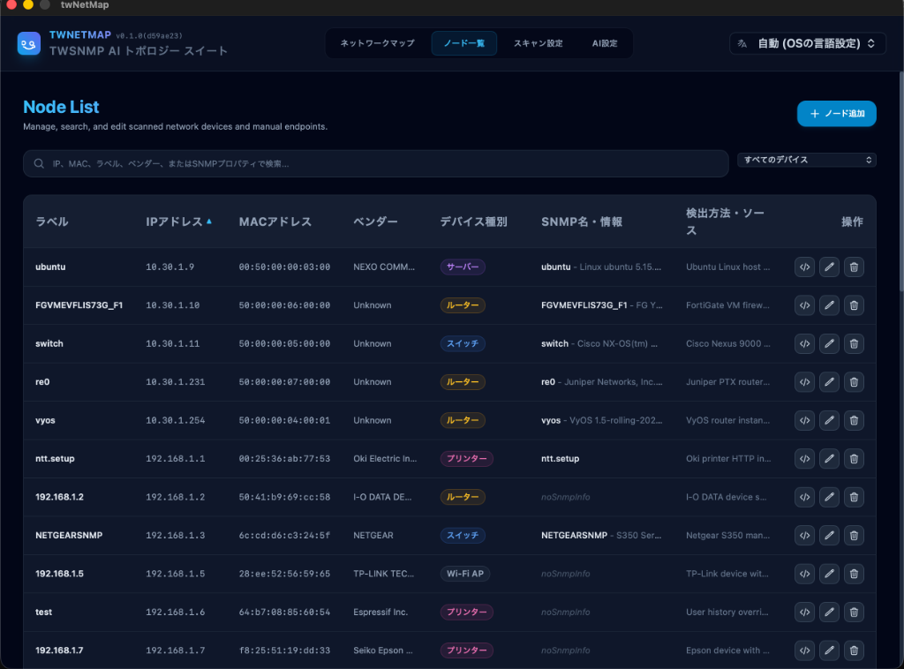
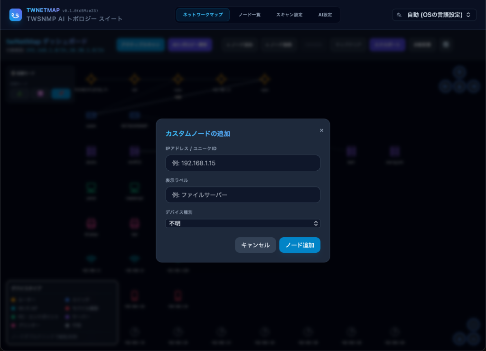
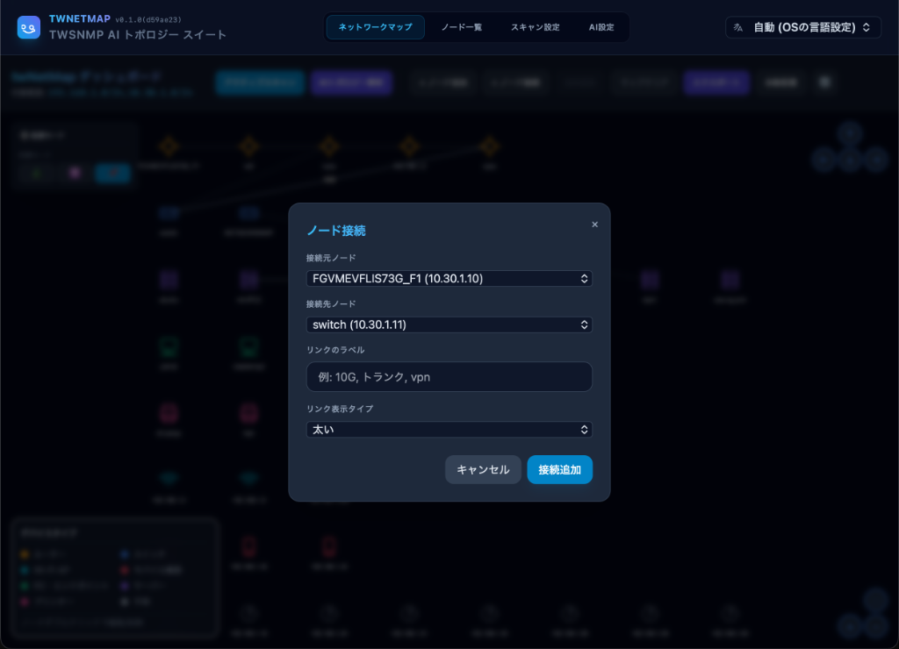
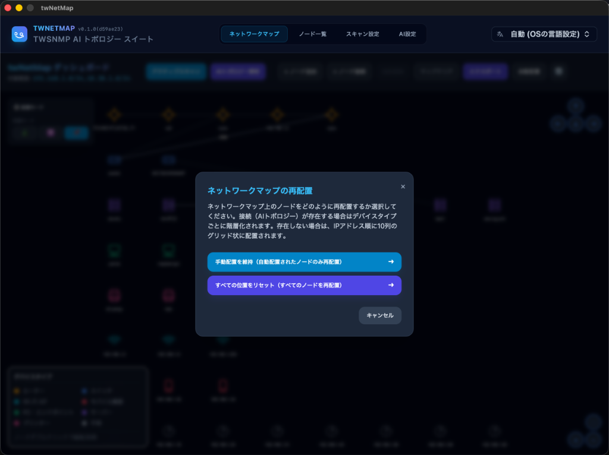

# twNetMap

[English](README.md)



スキャンしたデータからネットワークマップを自動生成する、AI搭載ネットワーク検出ツールです。Go、Wails v2、およびSvelteで構築されています。

---

## 主な機能

1. **アクティブ＆パッシブネットワークスキャン**
   - **Pingチェック**: ICMPを用いてホストの到達性を確認します（非特権UDP ping、OSネイティブコマンドへのフォールバック対応）。
   - **ARPテーブル解析**: ローカルシステムおよびアクティブなSNMPエージェントからIP-MACマッピングテーブルを自動的に抽出します。
   - **ポートスキャン**: 一般的なTCPポート（21, 22, 23, 25, 80, 110, 143, 161, 443, 3306, 3389, 5432, 8080, 9100）をスキャンします。
   - **SNMPクエリ (v2c/v3)**: リモートエージェントに対してクエリを実行し、システム情報（`sysName`、`sysDesc`）、物理MACアドレス、およびLLDP（Link Layer Discovery Protocol）ネイバー情報を取得します。
   - **サービスバナー取得**: オープンポートに接続してSSH/FTPバナーをキャプチャし、HTMLレスポンスのタイトル等をパースしてクリーンアップします。

2. **AI駆動トポロジー推論**
   - [langchaingo](file:///Users/ymi/prj/twsnmp/twNetMap/go.mod#L8) を使用して、複数のLLMプロバイダー（**Ollama**、**OpenAI**、**Google Gemini**）と連携します。
   - デバイスタイプを標準カテゴリ（`router`、`switch`、`wifi`、`mobile`、`pc`、`server`、`printer`、`unknown`）に分類します。
   - LLDPトポロジー情報などの構造的推論を活用し、デバイス間のリンク関係を自動的に構築します。
   - **フィードバックループ**: ユーザーによる手動の編集（ノード情報の修正やリンクの削除）を履歴データとして保存し、次回のAIプロンプトに優先反映することで、推論の精度をユーザーの好みに適合させていきます。

3. **インタラクティブなネットワークマップ可視化**
   - `vis-network` を使用して、マップを動的かつレスポンシブに描画します。
   - ユーザーは手動でノードやリンクの追加、編集、削除を行うことができます。
   - ノードのドラッグ＆ドロップによるレイアウト調整や、自動再配置を実行可能です。

4. **充実したデータエクスポート機能**
   - **画像/ドキュメント**: PNG、SVG、PDF
   - **図面**: Draw.io (`.drawio`)
   - **データ**: JSON形式のマップデータ、JSON形式のスキャン生結果、CSV形式のノードリスト、Excelドキュメント (`.xlsx`)

---

## インストール方法

### GitHubリリースからのダウンロード
[GitHub Releases](https://github.com/twsnmp/twNetMap/releases) ページから、ビルド済みのスタンドアロンバイナリをダウンロードしてインストールできます。

#### macOS版
- macOS版は、署名および公証済みの **PKG** 形式のインストーラー（`.pkg`）として提供されています。
- PKGファイルをダウンロードし、ダブルクリックして起動し、インストールウィザードの指示に従ってください。

#### Windows版
- Windows版はデジタル署名されていません。ダウンロードしたZIPファイルを解凍しただけでは、Windows Defender SmartScreenによって起動がブロックされる場合があります。
- **ブロックを解除して起動する方法**:
  1. ダウンロードしたZIPファイルを解凍します。
  2. 解凍したフォルダー内にある `twNetMap.exe` を右クリックし、**「プロパティ」** を選択します。
  3. 「全般」タブの一番下にあるセキュリティ項目で、**「許可する」** または **「ブロックの解除」** にチェックを入れて「OK」をクリックします。
  4. または、起動時に「WindowsによってPCが保護されました」という警告画面（青い画面）が表示された場合は、**「詳細情報」** をクリックし、表示された **「実行」** ボタンを押して起動してください。

#### Linux版
- Linux版は、スタンドアロンの実行可能バイナリとして提供されています。
- Linuxのセキュリティ制限により、一般ユーザー（root以外のユーザー）で実行する際、ネットワークスキャン機能（特にPingなど）を正常に動作させるためには以下の設定が必要になる場合があります。
  - **非特権ICMP (Ping) の許可**:
    一般ユーザーがICMPパケット（Ping）を送信できるように、以下のカーネルパラメータを設定します。
    ```bash
    sudo sysctl -w net.ipv4.ping_group_range="0 2147483647"
    ```
    設定を永続化させるには、`/etc/sysctl.conf` または `/etc/sysctl.d/99-ping.conf` に `net.ipv4.ping_group_range = 0 2147483647` と追記してください。
  - **RAWソケットの権限付与**:
    RAWソケットを直接使用してPing等の実行を行う場合、コンパイル済みのバイナリに対して以下のケーパビリティを付与します。
    ```bash
    sudo setcap cap_net_raw+ep ./twNetMap
    ```
  - **ファイアウォール設定**:
    SNMPによる情報取得（UDPポート161）やポートスキャン（各種TCPポート）の送信トラフィックが、ローカルのファイアウォール（UFWやfirewalldなど）でブロックされないよう許可してください。

---

## 操作方法

以下の手順でネットワークの検出とマップ生成を行います：

### 1. スキャン設定 (Scan Settings)
スキャン対象のIPアドレス範囲を設定します（`192.168.1.0/24` のようなCIDR形式、`192.168.1.1-192.168.1.50` のような範囲形式、またはカンマ区切りの複数ターゲット）。SNMPエージェントから情報を取得する場合は、SNMPの認証パラメータ（コミュニティ名やSNMP v3のユーザー名/パスワード）を設定します。



### 2. AI設定 (AI Settings)
トポロジー推論に使用するLLMプロバイダー（Google Gemini、OpenAI、またはローカルで動作する Ollama）を選択し、APIキーやモデルパラメータを設定します。このLLMは、デバイス間の隣接関係の分析やデバイスタイプの自動分類に使用されます。



### 3. ネットワーク検出とトポロジー生成
ネットワークスキャンを実行します。スキャン完了後、検出されたデバイス情報やLLDP等の情報をAIが分析し、スイッチやルーターなどの接続関係を推論してネットワークマップを自動生成します。



### 4. マップの調整とエクスポート
生成されたマップは、`vis-network` の機能により、ドラッグ＆ドロップでノードの位置を変更したり、手動でノードやリンクの追加、編集、削除を行うことができます。手動で行った編集内容はシステムに学習データとして記憶され、次回のAI推論の精度向上に役立ちます。また、デバイス情報をテーブル形式で確認したり、マップをPNG、SVG、PDF、CSV、Excel、Draw.ioファイル形式でエクスポートすることも可能です。



### 5. カスタムノードの追加
自動検出されなかったデバイスや、手動でエンドポイントをマップに追加したい場合は、ダッシュボード上の「+ ノード追加」ボタンをクリックします。IPアドレスまたはユニークID、表示ラベルを入力し、デバイス種別を選択して追加します。



### 6. ノード間の接続追加・編集・削除
手動でデバイス間にリンク（接続）を作成するには、ダッシュボード上の「+ ノード接続」ボタンをクリックします。接続元のノードと接続先のノードをドロップダウンリストから選択し、必要に応じてリンクのラベル（例：「10G, トランク, vpn」）や表示スタイルを設定して「接続追加」をクリックします。

また、**Shiftキーを押しながらマップ上の2つのデバイスを順番にクリック**することでも、リンクの追加ダイアログを表示できます。



#### リンクの編集と削除
- **編集**: マップ上のリンクをクリックして選択すると、ダッシュボードの「接続編集」ボタンが有効になります。
- **削除**: リンクの編集ダイアログを開き、ダイアログ内にある「削除」ボタンをクリックします。


### 7. ネットワークマップのエクスポート
作成したマップや検出データを外部に保存するには、ダッシュボード上の「エクスポート」ボタンをクリックします。以下の多彩なフォーマットに対応しています：
- **PNG / SVG画像**: マップの視覚的なレイアウトを画像またはベクター形式で出力します。
- **PDFドキュメント**: マップをPDFページとして出力します。
- **Draw.io ダイアグラム (.drawio)**: diagrams.net (Draw.io) で直接読み込んで編集可能なダイアグラムを出力します。
- **マップJSON**: ノードやリンク、レイアウト情報を含んだ構造化データを出力します。
- **スキャンJSON**: IP/MACやSNMPサービス等のスキャン結果生データを出力します。
- **ノード一覧 (CSV)**: 検出されたデバイス詳細をCSV形式で出力します。
- **Excelドキュメント**: マップ画像とデバイス詳細シートを含んだ構造化されたスプレッドシートを出力します。


### 8. ネットワークマップの自動再配置
マップ上のノードの配置を自動で整理するには、ダッシュボード上の「自動配置」ボタンをクリックします。以下のいずれかの再配置オプションを選択できます：
- **手動配置を維持（自動配置されたノードのみ再配置）**: ユーザーが手動で位置を調整したノードの場所を固定したまま、新しく追加されたノードや自動検出されたノードのみを再配置します。
- **すべての位置をリセット（すべてのノードを再配置）**: これまでの手動配置をすべてリセットし、マップ全体を再整理します。接続関係（トポロジー）が存在する場合はデバイスタイプごとに階層化（グループ化）して配置され、接続関係がないノードはIPアドレス順に10列のグリッド状に整理して並べられます。



---

## 注意事項・セキュリティについて

> [!WARNING]
> **スキャンの許可について**: 本ツールは、アクティブなネットワークスキャン（ICMP Ping、TCPポートスキャン、SNMPクエリ、サービスバナー取得など）を実行します。所有していないネットワークや、スキャンの明示的な許可を得ていないネットワーク・ホストに対して実行すると、セキュリティポリシー違反や法的問題に発展する可能性があります。必ずご自身が管理しているネットワーク、またはスキャンが許可されている対象にのみ実行してください。

---

## 技術スタック

- **バックエンド (Go)**
  - アプリケーションフレームワーク: [Wails v2](https://wails.io) (v2.12.0)
  - データベース: [bbolt](https://github.com/etcd-io/bbolt)（組み込みキーバリューストア）
  - LLM連携: [langchaingo](https://github.com/tmc/langchaingo)
  - SNMPクライアント: [gosnmp](https://github.com/gosnmp/gosnmp)
  - エクスポートライブラリ: [gopdf](https://github.com/signintech/gopdf), [excelize](https://github.com/xuri/excelize)
- **フロントエンド (Svelte & CSS)**
  - UIライブラリ: Svelte 5
  - ビルドシステム: Vite
  - スタイル: Tailwind CSS 3
  - 可視化: `vis-network`

---

## プロジェクト構成

- [main.go](file:///Users/ymi/prj/twsnmp/twNetMap/main.go): Wailsアプリケーションを起動するデスクトップ版のエントリーポイント。
- [app.go](file:///Users/ymi/prj/twsnmp/twNetMap/app.go): コアデータベース操作、スキャン制御、AIロジック、およびファイルダイアログを公開するWailsバインディングメソッド群。
- `backend/`:
  - [ai/ai.go](file:///Users/ymi/prj/twsnmp/twNetMap/backend/ai/ai.go): システム/ユーザーLLMプロンプトの構築、およびプロバイダー認証（Gemini、OpenAI、Ollama）の処理。
  - [scanner/scanner.go](file:///Users/ymi/prj/twsnmp/twNetMap/backend/scanner/scanner.go): IP範囲の解析、ICMP/Ping、TCPポートスキャン、SNMPウォーク、およびバナー取得の実行。
  - [datastore/db.go](file:///Users/ymi/prj/twsnmp/twNetMap/backend/datastore/db.go): スキャン結果、ノード設定、ユーザー編集履歴を管理するローカル `bbolt` バケットの操作。
- `frontend/`:
  - `src/App.svelte`: レイアウトとページルーティングを管理するルートビュー。
  - `src/routes/`:
    - `NetworkMap.svelte`: ノード/リンクを表示し、マップに対する操作を処理する可視化画面。
    - `NodeList.svelte`: 検出されたデバイスをリスト/テーブル形式で編集できる画面。
    - `ScanSettings.svelte` / `AISettings.svelte`: スキャン対象やAIプロバイダー等の管理設定画面。

---

## ビルド方法

`mise` を使用することで、必要なツールチェーン（Go、Node.js）のバージョン管理と、開発やビルドのタスク実行をすべて一括で簡単に行うことができます。

### 前提条件
- システムに [mise](https://mise.jdx.dev/) がインストールされていること。
- Wails CLI（miseでGoをインストール後、`go install github.com/wailsapp/wails/v2/cmd/wails@latest` でインストールできます）。

### ツールのセットアップ
`.mise.toml` で定義されている必要なバージョンの Go と Node.js をインストールします：
```bash
mise install
```

### 開発モードでの実行
ホットリロードを有効にして、デバッグモードでアプリケーションを起動します（Gitタグ情報からバージョンを自動的に取得して `wails dev` を実行します）：
```bash
mise run dev
```

### プロダクションビルドの作成
お使いのOS向けに、スタンドアロンのプロダクション実行可能バイナリをコンパイルします（フロントエンドアセットのビルドと、バージョンフラグを付与したGoバックエンドのビルドを自動的に実行します）：
```bash
mise run build
```
